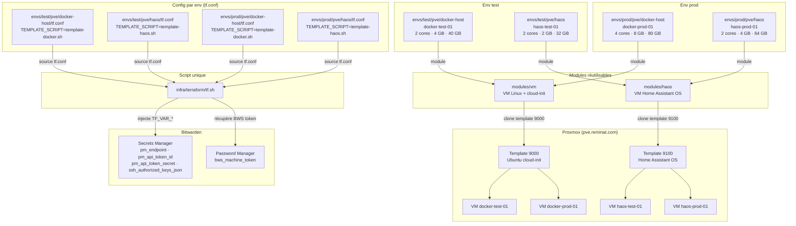

# Terraform — How-To : provisionner from scratch

Ce guide couvre tout le workflow depuis zéro : prérequis, secrets, provisioning test puis prod, et récupération des IPs.

---

## Architecture



Chaque env a son propre state Terraform — test et prod ne se connaissent pas.

---

## Prérequis

### Outils à installer

```bash
brew install terraform
brew install bitwarden-cli             # bw
brew install bitwarden/secrets/bws     # bws (Secrets Manager CLI)
brew install rsync
```

Vérifier :

```bash
terraform version   # >= 1.6.0
bw --version
bws --version
```

### Clé SSH Proxmox

La clé `~/.ssh/id_ed25519_pve` doit exister et être autorisée sur `root@pve`.
Si elle n'existe pas encore :

```bash
ssh-keygen -t ed25519 -f ~/.ssh/id_ed25519_pve -C "terraform@pve"
ssh-copy-id -i ~/.ssh/id_ed25519_pve.pub root@pve.reminat.com
```

---

## Secrets dans Bitwarden

Le script `tf.sh` va chercher les secrets automatiquement au moment du `apply`. Il faut les avoir créés au préalable.

### Dans Bitwarden Password Manager (bw)

Un item avec comme **password** le token Bitwarden Secrets Manager :

| Item name           | Champ    | Valeur               |
|---------------------|----------|----------------------|
| `bws_machine_token` | password | `<ton BWS access token>` |

### Dans Bitwarden Secrets Manager (bws)

Quatre secrets à créer, identifiés par leur **key** (nom) :

| Key                        | Valeur exemple                         |
|----------------------------|----------------------------------------|
| `pm_endpoint`              | `https://pve.reminat.com:8006`           |
| `pm_api_token_id`          | `terraform@pve!tf`                     |
| `pm_api_token_secret`      | `xxxxxxxx-xxxx-xxxx-xxxx-xxxxxxxxxxxx` |
| `ssh_authorized_keys_json` | `["ssh-ed25519 AAAA... remi@mac"]`     |

> `ssh_authorized_keys_json` est un tableau JSON de clés publiques SSH. Ces clés seront injectées dans cloud-init et seront les seules autorisées à se connecter en SSH sur les VMs.

### Créer le token API Proxmox

Dans l'UI Proxmox → Datacenter → Permissions → API Tokens :
- User : `terraform@pve`
- Token ID : `tf`
- Privilege Separation : **désactivé** (pour hériter des droits de l'user)

Puis dans Datacenter → Permissions → Add → API Token Permission :
- Path : `/`
- Role : `PVEAdmin` (ou un rôle custom avec au moins VM.Allocate, VM.Config.*, Datastore.AllocateSpace)

---

## Templates Proxmox

Les VMs sont créées par **clone** depuis des templates.

| Template     | VM ID  | Script de création                            |
|--------------|--------|-----------------------------------------------|
| Ubuntu cloud | `9000` | `infra/proxmox/scripts/template-docker.sh`    |
| HAOS         | `9100` | `infra/proxmox/scripts/template-haos.sh`      |

**Tu n'as rien à faire manuellement.** Avant chaque `apply`, `tf.sh` vérifie automatiquement si le template existe sur Proxmox (via `qm status <vmid>`). S'il est absent, il copie le script depuis le repo et l'exécute sur Proxmox via SSH.

```
./tf.sh test/pve/docker-host apply
  └─ tf.conf lu : TEMPLATE_SCRIPT=template-docker.sh, TEMPLATE_VM_ID=9000
       └─ qm status 9000 sur pve → absent ?
            ├─ oui → scp template-docker.sh → ssh bash /tmp/template-docker.sh
            └─ non → skipped
  └─ terraform apply (snippet + clone VM)
```

Pour forcer le saut de cette vérification (template déjà présent, gain de temps) :

```bash
TFWRAP_SKIP_TEMPLATE_BUILD=1 ./tf.sh test/pve/docker-host apply
```

---

## Provisionner les machines

### Ordre recommandé : test d'abord, prod ensuite

### 1. Initialiser Terraform (une fois par env, après un clone du repo)

```bash
cd infra/terraform/envs/test/pve/docker-host && terraform init
cd ../haos                                    && terraform init
cd ../../prod/pve/docker-host                 && terraform init
cd ../haos                                    && terraform init
```

> `terraform init` télécharge le provider `bpg/proxmox`. Il n'a pas besoin des secrets Bitwarden.

### 2. Se connecter à Bitwarden

```bash
bw login          # ou bw unlock si déjà connecté
export BW_SESSION="$(bw unlock --raw)"
```

### 3. Appliquer l'env test

```bash
cd infra/terraform

./tf.sh test/pve/docker-host plan    # vérifier ce qui va être créé
./tf.sh test/pve/docker-host apply

./tf.sh test/pve/haos plan
./tf.sh test/pve/haos apply
```

### 4. Appliquer l'env prod

```bash
./tf.sh prod/pve/docker-host plan
./tf.sh prod/pve/docker-host apply

./tf.sh prod/pve/haos plan
./tf.sh prod/pve/haos apply
```

---

## Trouver les IPs des VMs après provisioning

Les VMs démarrent en **DHCP**. L'IP n'est pas connue à l'avance par Terraform.

### Option 1 — Via Proxmox (le plus simple)

UI Proxmox → cliquer sur la VM → onglet **Summary** → champ **IP Address**
(visible grâce au qemu-guest-agent installé par cloud-init).

### Option 2 — Via la CLI Proxmox

```bash
ssh root@pve.reminat.com "qm guest cmd <vmid> network-get-interfaces" | \
  python3 -c "
import sys, json
for iface in json.load(sys.stdin)['return']:
    for ip in iface.get('ip-addresses', []):
        if ip['ip-address-type'] == 'ipv4' and not ip['ip-address'].startswith('127'):
            print(iface['name'], ip['ip-address'])
"
```

Remplacer `<vmid>` par l'ID Proxmox de la VM (visible dans l'UI).

### Option 3 — Via le DHCP de ton routeur

La VM apparaîtra dans les baux DHCP avec son hostname (`docker-test-01`, etc.).

### Option 4 (recommandée à terme) — Réservations DHCP statiques

Une fois que tu connais l'IP attribuée la première fois :

1. Relève l'adresse MAC dans Proxmox (VM → Hardware → Network Device)
2. Crée une réservation DHCP dans ton routeur / pfSense / OPNsense
3. Les VMs auront toujours la même IP sans rien changer dans Terraform

Plage suggérée :

| Machine        | IP suggérée   |
|----------------|---------------|
| docker-test-01 | 10.10.20.11   |
| docker-prod-01 | 10.10.20.10   |
| haos-test-01   | 10.10.20.21   |
| haos-prod-01   | 10.10.20.20   |

---

## Bootstrap SSH sur les VMs HAOS

> **Étape scriptée, à faire une seule fois après le premier `apply` HAOS.**

HAOS ne supporte pas cloud-init — les clés SSH ne peuvent pas être injectées par Terraform comme pour le docker host. Le script `bootstrap-haos.sh` injecte automatiquement les clés via le QEMU guest agent, sans toucher à la console Proxmox.

### Commande

```bash
cd infra/proxmox/scripts

./bootstrap-haos.sh test   # VM haos-test-01
./bootstrap-haos.sh prod   # VM haos-prod-01
```

Le script :
1. S'authentifie à Bitwarden (même pattern que `tf.sh`)
2. Récupère les clés SSH depuis `ssh_authorized_keys_json` dans Bitwarden Secrets Manager
3. Récupère l'endpoint Proxmox depuis `pm_endpoint`
4. Trouve le VMID de la VM par son nom via `qm list`
5. Attend que le QEMU guest agent soit prêt (jusqu'à 2 min)
6. Injecte les clés dans `/root/.ssh/authorized_keys` via `qm guest exec`

> L'utilisateur sur HAOS est `root` (pas `remi` comme sur le docker host).

### Prérequis

- La VM HAOS doit être démarrée
- `~/.ssh/id_ed25519_pve` doit permettre l'accès SSH à Proxmox
- Le QEMU guest agent doit être actif sur la VM (configuré dans le template)

### Ordre complet pour un déploiement from scratch

```
1. terraform apply haos              → VM créée et démarrée
2. ./bootstrap-haos.sh <env>         → clés SSH injectées automatiquement
3. ansible deploy.sh <env> --limit haos  → configuration.yaml déployé
```

---

## Détruire un env (ex: reconstruire test from scratch)

```bash
cd infra/terraform

./tf.sh test/pve/docker-host destroy
./tf.sh test/pve/haos destroy
```

> Le state est sauvegardé sur le NAS automatiquement après chaque `apply` et `destroy`.

---

## Récapitulatif des commandes courantes

Toutes les commandes s'exécutent depuis `infra/terraform/` en passant le chemin de l'env en premier argument. Le script lit `tf.conf` dans l'env pour savoir quel template Proxmox builder avant l'apply.

```bash
cd infra/terraform
```

| Action                           | Commande                                                              |
|----------------------------------|-----------------------------------------------------------------------|
| Voir ce qui va changer           | `./tf.sh <env> plan`                                                  |
| Appliquer                        | `./tf.sh <env> apply`                                                 |
| Appliquer sans rebuild template  | `TFWRAP_SKIP_TEMPLATE_BUILD=1 ./tf.sh <env> apply`                   |
| Détruire                         | `./tf.sh <env> destroy`                                               |
| Debug verbeux                    | `TFWRAP_DEBUG=1 ./tf.sh <env> plan`                                   |
| Voir les outputs                 | `cd envs/<env> && terraform output`                                   |

Où `<env>` est un chemin relatif depuis `envs/`, par exemple `test/pve/docker-host` ou `prod/pve/haos`.

---

## Résolution de problèmes courants

**`Missing command: bws`**
→ `brew install bitwarden/secrets/bws`

**`Could not resolve Bitwarden Secrets Manager secret 'pm_endpoint'`**
→ Vérifier que le secret existe dans BSM avec exactement ce **key** (pas juste le nom d'affichage).

**`Error: could not connect to Proxmox`**
→ Vérifier que `pm_endpoint` pointe sur l'API Proxmox et que le token est valide.

**`Error cloning VM: template not found`**
→ Le template n'a pas été créé. Vérifier que `TEMPLATE_VM_ID` est bien défini dans `tf.conf` et que `TFWRAP_SKIP_TEMPLATE_BUILD` n'est pas forcé à `1`. En dernier recours, créer le template manuellement en copiant le script sur Proxmox :
```bash
scp infra/proxmox/scripts/template-docker.sh root@pve.reminat.com:/tmp/
ssh root@pve.reminat.com "bash /tmp/template-docker.sh"
```

**`ERROR: template script not found`**
→ Le fichier `infra/proxmox/scripts/<TEMPLATE_SCRIPT>` n'existe pas dans le repo. Vérifier la valeur de `TEMPLATE_SCRIPT` dans `tf.conf`.

**L'IP n'apparaît pas dans Proxmox Summary**
→ Le qemu-guest-agent n'a pas encore démarré. Attendre ~30s après le boot, ou vérifier cloud-init sur la VM : `journalctl -u cloud-init`.
